# Hausarbeit

## Inhaltsverzeichnis

- [1. Einleitung](#1-einleitung)
  - [1.1 Motivation](#11-motivation)
  - [1.2 Zielsetzung und Umfang](#12-zielsetzung-und-umfang)
    - [Teilnehmer](#teilnehmer)
    - [Rundenablauf](#rundenablauf)
    - [Das Spielfeld](#das-spielfeld)
    - [Begrenzung des Umfangs](#begrenzung-des-umfangs)
- [2. Bibliotheken und Entwicklungswerkzeuge](#2-bibliotheken-und-entwicklungswerkzeuge)
- [3. Konzept und Implementierung](#3-konzept-und-implementierung)
  - [3.1 Programmstruktur](#31-programmstruktur)
  - [3.2 Spieldaten als JSON](#32-spieldaten-als-json)
  - [3.3 Datenimport und Validierung](#33-datenimport-und-validierung-content)
  - [3.4 Modellierung der Regellogik](#34-modellierung-der-regellogik-domain)
  - [3.5 Anwendungssteuerung und Schnittstellen](#35-anwendungssteuerung-und-schnittstellen-engine)
  - [3.6 Technischer Ablauf am Beispiel eines Zaubers](#36-technischer-ablauf-am-beispiel-eines-zaubers)
  - [3.7 KI-Unterstützung im Entwicklungsprozess](#37-ki-unterstützung-im-entwicklungsprozess)
- [4. Ergebnisse](#4-ergebnisse)
- [5. Diskussion](#5-diskussion)
  - [5.1 Zielerreichung](#51-zielerreichung)
  - [5.2 Abweichungen vom Plan](#52-abweichungen-vom-plan)
  - [5.3 Kritische Würdigung](#53-kritische-würdigung)
    - [KI-Zusammenarbeit](#ki-zusammenarbeit)
  - [5.4 Ausblick](#54-ausblick)
- [6. Literatur- und Quellenverzeichnis](#6-literatur-und-quellenverzeichnis)
- [7. Anhang](#7-anhang)
  - [7.1 Bedienungsanleitung](#71-bedienungsanleitung)
  - [7.2 Beispieldurchläufe](#72-beispieldurchläufe)
    - [7.2.1 Ein Fighter gegen zwei Goblins](#721-ein-fighter-gegen-zwei-goblins)
    - [7.2.2 Flächenzauber](#722-flächenzauber)
    - [7.2.3 Zwei Bots: Goblin-Duell](#723-zwei-bots-goblin-duell)
    - [7.2.4 Ungültiger Input](#724-ungültiger-input)
  - [7.3 Ausgewählte Code-Snippets](#73-ausgewählte-code-snippets)

## 1. Einleitung

Dungeons and Dragons ist ein beliebtes Pen and Paper-Rollenspiel, in dem taktische, rundenbasierte Kämpfe einen großen Teil des Spiels ausmachen. Üblicherweise sind die Teilnehmer eines Kampfes ein Team von Spielern und ein Team von Gegnern, die vom Spielleiter gesteuert werden. 
Das System Reference Document 5.2.1 (SRD) ist eine unter der Creative Commons License CC-BY-4.0 verfügbare Fassung der Spielregeln, die den größten Teil der Grundmechaniken des Spiels enthält, in der aber viele Inhalte des eigentlichen Spiels fehlen. So kann ein Spieler beispielsweise für seinen Charakter eine Klasse und Subklasse wählen, jedoch steht pro Klasse nur eine Subklasse zur Verfügung, während im proprietär lizensierten Spielerhandbuch pro Klasse vier Subklassen zur Auswahl stehen.
Dieses Programm, SRD Arena, setzt zunächst einen Teil des Kampfsystems des SRD als rundenbasiertes 2D-Spiel um. Es gibt mehrere vordefinierte Kampfszenarien, die die umgesetzten Funktionalitäten demonstrieren. Anhand von Vorlagen können in weiteren Dateien auch weitere Szenarien vom Nutzer definiert und anschließend gespielt werden.

### 1.1 Motivation

Die meisten Spielleiter entwerfen die Kampfszenarien für ihre Spieler bereits vor dem eigentlichen Spieltermin. Aus Sicht des Spielleiters gehört zu den Zielen eines Kampfes, den Spielern eine taktische Herausforderung zu bieten, ohne dass der Kampf zu schwer wird.

Im Rahmen der umgesetzten Regeln können Spielleiter mit diesem Programm ihre Kampfszenarien vor dem eigentlichen Spiel mehrfach ausprobieren. Das ist bereits vorteilhaft, weil im Programm viele Berechnungen und Würfe von Würfeln automatisch stattfinden, die sonst händisch geschehen müssten. Mittelfristig, aber nach Abgabe des Projektes, soll der gesamte Umfang der SRD-Regeln abgedeckt werden. 

Langfristig wäre es auch möglich, das Projekt um eine Option zu erweitern, die Kampfentscheidungen aller Teilnehmer durch klügere Bots automatisiert. Dann könnten Kämpfe vielfach simuliert werden, um Statistiken zu erzeugen. Für einen Spielleiter wäre dann nicht nur erkennbar, ob ein Encounter einmal gewonnen wurde, sondern auch, wie häufig ein Team gewinnt und welche Teilnehmer besonders großen Einfluss auf das Ergebnis haben. Die im Projekt umgesetzte Kampfengine soll dafür später die technische Grundlage bilden.


### 1.2 Zielsetzung und Umfang

SRD Arena ist eine Engine für taktische Kämpfe auf einem 2D-Spielfeld nach dem SRD 5.2.1-Regelwerk. In einer GUI kann der Nutzer Kampfszenarien spielen. Die Steuerung der Teilnehmer erfolgt wahlweise durch Nutzerinput, oder durch sehr simple Bots.
In strukturierten Textdateien können Kampfszenarien definiert werden. Ein Kampf besteht aus Teams, die Mitglieder beinhalten. Jedes Mitglied hat eine Startposition auf dem Spielfeld, sowie eine Referenz auf eine Definition ihrer Attribute und Fähigkeiten.

#### Teilnehmer
Während des Kampfes verwaltet die Engine für jeden Teilnehmer unter anderem Lebenspunkte, Position, Bedingungen und verbleibende Aktionsressourcen. Werte wie Rüstungsklasse, Bewegungsgeschwindigkeit, Angriffe und bekannte Zauber stammen aus der zugehörigen Kreaturendefinition.

#### Rundenablauf
Zu Beginn des Encounters bestimmt ein Initiativewurf die Reihenfolge, in der Teilnehmer ihre Züge ausführen. Nach dem Zug des letzten Teilnehmers beginnt eine neue Runde.
Während seines Zuges verfügt ein Teilnehmer grundsätzlich über Bewegung, eine Aktion und eine Bonusaktion. Die Engine verwaltet diese Ressourcen und verhindert ihre mehrfache Verwendung.
Bestimmte Ereignisse können eine Reaktion eines anderen Teilnehmers auslösen und den laufenden Zug vorübergehend unterbrechen. Eine implementierte Anwendung ist der Gelegenheitsangriff beim Verlassen der Reichweite eines Gegners. Eine verbrauchte Reaktion wird zu Beginn des nächsten eigenen Zuges wieder verfügbar.

#### Das Spielfeld
Die Engine modelliert das Spielfeld als Gitter aus quadratischen Feldern. Die Seite eines Feldes repräsentiert den Regeln entsprechend fünf Fuß in der Spielwelt.


#### Begrenzung des Umfangs
Der Umfang der Abgabe ist bewusst kleiner als der Umfang des SRD. Unterstützt wird jeweils ein einzelner Encounter mit eingeschränkten Kampfregeln. Nicht Teil der Abgabe sind eine vollständige Abbildung aller Klassen und Zauber, eine allgemeine Ausrüstungsverwaltung sowie mehrere aufeinanderfolgende Encounter. Diese Begrenzung ermöglicht es, die unterstützten Regeln innerhalb eines vollständigen Kampfablaufs zu verbinden und zu testen.


## 2. Bibliotheken und Entwicklungswerkzeuge

Zur Laufzeit verwendet SRD Arena hauptsächlich Pydantic und PySide6. Pydantic bildet die Schemata der JSON-Inhalte ab und validiert eingelesene Daten, bevor daraus Objekte des Fachmodells entstehen. Dadurch müssen Struktur- und Typprüfungen nicht für jedes Eingabeformat manuell implementiert werden. Die Desktop-GUI ist mit PySide6 implementiert. Eine Alternative wäre eine browserbasierte Oberfläche gewesen, aber zum Zeitpunkt der Entscheidung war ich aus den Übungen noch mit PySide6 vertrauter. Eine browserbasierte Nutzeroberfläche hätte bereits Grundlagen dafür gelegt, SRD Arena irgendwann online bereitzustellen.

Für automatisierte Tests wird pytest genutzt. Hypothesis ergänzt beispielbasierte Tests um generierte Eingaben, mit denen unter anderem die Grenzen der Lebenspunktlogik geprüft werden. pytest-cov misst die erreichte Testabdeckung. mypy prüft die Typannotationen, Ruff prüft die einheitliche Formatierung, Interrogate misst die Abdeckung durch Dokumentation. 

Während der Entwicklung wurden mit GitHub Actions durch eine CI-Pipeline die mypy- und ruff-Prüfungen laufend durchgeführt. Die CI-Pipeline erzeugt auch mithilfe von Sphinx eine GitHub Pages-Dokumentationsseite.

Die Python-Abhängigkeiten sind in der pyproject.toml erfasst und werden mit uv installiert. uv wird außerdem verwendet, um die Entwicklungswerkzeuge in einer einheitlichen Projektumgebung auszuführen.

Pydantic und PySide6 werden zur Laufzeit von der Anwendung benötigt. Die übrigen Pakete dienen nur der Entwicklung und Dokumentation.

## 3. Konzept und Implementierung

### 3.1 Programmstruktur
Der Quellcode ist nach Verantwortungsbereichen in die Python-Pakete content, domain, engine und frontends gegliedert. Neben dem Quellcode gibt es ein Content-Verzeichnis, in dem Spielregeln als JSON-Dateien hinterlegt sind. Das Content-Paket liest die in JSON-Dateien definierten Spieldaten, validiert sie und übersetzt sie in Domain-Objekte. Die Domain enthält den veränderlichen Encounterzustand sowie die davon unabhängigen Kampfregeln. Die Engine stellt mit Session, Commands und Observations eine frontendneutrale Schnittstelle bereit und koordiniert die Interaktion mit der Domain. Die Frontends setzen Benutzereingaben in Engine-Befehle um und stellen die zurückgegebenen Beobachtungen dar.
Die Abhängigkeiten verlaufen überwiegend in Richtung der Domain: Diese kennt weder Content, Engine noch Frontends. Die Engine verwendet die Domain, ist aber nicht für das Laden von Dateien zuständig. Die Frontends steuern einen laufenden Kampf über die Engine-Schnittstelle. Direkte Zugriffe auf den Content-Bereich dienen lediglich der Encounter-Auswahl und Darstellungskonfiguration; die GUI verwendet zusätzlich zustandslose Geometriefunktionen für visuelle Vorschauen. Architekturtests prüfen diese Paketgrenzen. Die folgenden Abschnitte erläutern Datenverarbeitung, Regellogik und Anwendungssteuerung getrennt, bevor Abschnitt 3.6 ihr Zusammenspiel am Beispiel der Verwendung eines Zaubers zeigt.

Die Aufteilung richtet sich damit nach Verantwortlichkeiten. Innerhalb der einzelnen Pakete gibt es eine weitere Aufteilung nach Spielfunktionen. Ein Zauber durchläuft zum Beispiel mehrere Bereiche, ohne dass das Einlesen seiner JSON-Datei, seine Regelwirkung und seine Darstellung in derselben Klasse behandelt werden.

### 3.2 Spieldaten als JSON
Das SRD ist eine PDF-Datei, in der alle Regeln in Prosa stehen. Es enthält zahlreiche Zauber, die sich in ihrer Funktionsweise ähneln. Betrachten wir zwei beispielhafte Zauber:


>**Cone of Cold:**
>You unleash a blast of cold air. Each creature in a 60-foot Cone originating from you makes a Constitution saving throw, taking 8d8 [wirf acht achtseitige Würfel] Cold damage on a failed save or half as much damage on a successful one. [...]

>**Burning Hands:**
>A thin sheet of flames shoots forth from you. Each creature in a 15-foot Cone makes a Dexterity saving throw, taking 3d6 [wirf drei sechsseitige Würfel] Fire damage on a failed save or half as much damage on a successful one.


Die Zauber verwenden unterschiedliche Schadenswürfel und Schadensarten, wirken aber beide in einem Kegel und verlangen einen Rettungswurf. Lediglich die Größe des Kegels und die konkreten Werte unterscheiden sich. Hier zeichnen sich bereits Mechanismen ab, die wiederverwendet werden können.

Die Seite 5e.tools, die unter der MIT-Lizenz ihren Quellcode verfügbar macht, hat bereits alle Zauber in ihr eigenes JSON-Schema überführt. Dieses Schema war nicht perfekt für SRD Arena geeignet, denn auch darin waren einzelne Mechanismen noch in Prosa versteckt. Es lieferte trotzdem bereits eine bessere Grundlage zur Weiterarbeit als die originale PDF-Datei, da das Schema nur umgeformt und erweitert werden musste und Inhalte auch für KI besser lesbar waren.

Für das Projekt wurde für die implementierten Zauber ein erweitertes JSON-Schema entworfen, sodass die zugrundeliegenden Mechaniken nur einmal implementiert und dann von den jeweiligen Zaubern verwendet werden können.
Für die Beispiele Cone of Cold und Burning Hands befinden sich im Anhang die Daten in JSON-Form, wie sie vom Programm verwendet werden.

Außerdem werden auch nutzerdefinierte Kampfszenarien direkt als JSON-Dateien geschrieben.

### 3.3 Datenimport und Validierung (content)

Die JSON-Inhaltsdateien werden durch die Content-Ebene eingelesen und mit Pydantic-Schemata validiert. Bei einem Kampfszenario werden unter anderem positive Spielfeldmaße, eindeutige Teilnehmerkennungen, gültige Teamzuordnungen und unterschiedliche Startpositionen je Teilnehmer auf dem Spielfeld geprüft. Anschließend übersetzen Builder die validierten Daten in Objekte der Domain. Fehlerhafte Inhalte werden bereits hier abgelehnt, damit die übrigen Bereiche mit bereits geprüften Inhalten arbeiten können.

### 3.4 Modellierung der Regellogik (domain)

Die Domain bildet die für den Kampf relevanten Konzepte wie Aktionen, Zauber und Effekte ab. Neben deren Definitionen enthält sie den veränderlichen Zustand eines laufenden Kampfes sowie die Regeln für Bewegung, Angriffe, Rettungswürfe, Schaden, Heilung und Bedingungen. Diese Regeln bestimmen, welche Aktionen im aktuellen Kampfzustand zulässig sind und wie ihre Ausführung den Zustand verändert. Der wichtige Unterschied zur Content-Ebene ist, dass im Content die Form der Eingabedateien modelliert wird, sodass diese in die Python-Objekte der Domain-Ebene übersetzt werden können. Die Regeln für Bewegung, Angriffe, Rettungswürfe, Schaden, Heilung und Bedingungen arbeiten auf diesem Zustand, kennen aber weder JSON-Dateien noch Elemente der GUI.

### 3.5 Anwendungssteuerung und Schnittstellen (engine)

Die Engine bildet die Schnittstelle zwischen Domain und Frontends. Sie gibt den aktuellen Kampfzustand und die zulässigen Aktionen als frontendneutrale Observation auf. Ein Frontend übermittelt die Auswahl des Nutzers als Befehl an die Engine, die dessen Ausführung an die Domain weitergibt und anschließend eine aktualisierte Observation erzeugt. Dadurch verwenden die GUI und das Headless-Frontend dieselbe Schnittstelle und müssen die interne Struktur der Domain nicht kennen.

### 3.6 Technischer Ablauf am Beispiel eines Zaubers

Beim Laden eines Encounters liest die Content-Ebene die Zauberdateien ein, validiert sie mit dem Pydantic-Modell `SpellSchema` und legt sie in einem Katalog ab. In Domänenobjekte vom Typ `Spell` werden anschließend nur die Zauber übersetzt, auf die eine Kreatur des Encounters verweist. Bei `Burning Hands` überführt der Builder das JSON-Feld `capability` in eine ausführbare Definition für Zielgebiet, Rettungswurf, Schaden und Skalierung. Das erzeugte Objekt wird dem Spellcasting der Kreatur zugeordnet. Während des Kampfes muss die JSON-Datei daher nicht erneut ausgewertet werden.

Ist die Kreatur am Zug, leitet die Domain aus ihren bekannten Zaubern die derzeit zulässigen `EncounterAction`-Objekte ab. Die Engine nimmt diese Aktionen in die Observation für das Frontend auf. Nach der Auswahl legt der Nutzer auf dem Spielfeld die Richtung des 15 Fuß langen Kegels fest. Das Frontend sendet diese Konfiguration über die Engine zurück.

Die konfigurierte Aktion gelangt über die Engine zum `EncounterOrchestrator` der Domain. Bei der Ausführung werden die Aktions- und Magieressourcen verbraucht und anschließend die Capability aufgelöst. Die Domain bestimmt alle Kreaturen im Kegel und führt für sie Geschicklichkeitsrettungswürfe aus. Bei einem Fehlschlag verursacht der Zauber 3d6 Feuerschaden, bei einem Erfolg die Hälfte, abgerundet. Der Schaden wird auf den `EncounterState` angewendet. Aus dem neuen Zustand sowie den erzeugten Meldungen und Ereignissen erstellt die Engine die nächste Observation. 


### 3.7 KI-Unterstützung im Entwicklungsprozess

Für dieses Projekt wurde der Quellcode in vielen Iterationen mit KI generiert. Meist formulierte ich eine möglichst genaue Anforderung für ein Feature oder einen Bug, ließ Codex einen Änderungsvorschlag erstellen und prüfte anschließend den generierten Code und die Auswirkungen auf das fertige Programm.

Viele Ideen zur wurden auch mit KI-Unterstützung auf Lücken geprüft und angepasst. Ich erwog zunächst, die Kosten eines Zaubers direkt in seiner Inhaltsdefinition abzulegen. Die KI wies darauf hin, dass die Kosten eines Zaubers sich je nach Anwender ändern können. Deshalb beschreibt der Zauber nur seine intrinsischen Eigenschaften, während die konkrete Nutzungsquelle festlegt, welche Ressource verbraucht wird.

Ein sehr komplizierter, beispielhafter Zauber zeigt auch, dass für das Design des Zauber-Schemas kritische Iteration und auch menschliches Einschreiten notwendig war. Es ist hier nicht wichtig, den gesamten Zauber zu verstehen. Wichtig ist nur, dass der Effekt viele einzelne Bestandteile hat.
> **Slow**
You alter time around up to six creatures of your choice in a 40-foot Cube within range. Each target must succeed on a Wisdom saving throw or be affected by this spell for the duration.
*An affected target's Speed is halved, it takes a -2 penalty to AC and Dexterity saving throws, and it can't take Reactions. On its turns, it can take either an action or a Bonus Action, not both, and it can make only one attack if it takes the Attack action. If it casts a spell with a Somatic component, there is a 25 percent chance the spell fails as a result of the target making the spell's gestures too slowly.
An affected target repeats the save at the end of each of its turns, ending the spell on itself on a success.*


Bis zu diesem Punkt hatte ich mithilfe der KI mögliche Felder für ein JSON-Schema gesammelt, das die Bestandteile verschiedener Zauber abbilden kann. Die zuvor genannten Beispiele, Cone of Cold und Burning Hands, zeigen, wann das gut geklappt hat. In diesem Fall versuchte die KI, jeden Bestandteil des kursiv gedruckten negativen Effektes in eigene Felder aufzuschachteln, sodass diese dann in der Domäne wieder zusammengesetzt werden können. Dieser Ansatz wäre fast eine domänenspezifische Sprache nur für Zauber gewesen, also bin ich eingeschritten und habe die Entscheidung getroffen, dass Effekte wie dieser, die kaum Potential zur Wiederverwendung haben, direkt in Python implementiert werden.


## 4. Ergebnisse

Im Anhang befinden sich mehrere Beispieldurchläufe mit Bildern, die hier zu viel Platz eingenommen hätten. Zuerst wird das Fenster zur Wahl von Kampfszenarien vorgestellt. Dann gibt es drei Testkämpfe, die jeweils ausgewählte Mechanismen vorstellen. 
Der erste Kampf ist mit Seed `0` zwischen einem Nutzergesteuerten Charakter und zwei Goblins. Sichtbar werden Bewegung und Nahkampfangriffe durch Nutzer und Bots.
Im zweiten Kampf steuert der Nutzer einen Zauberer gegen eine Gruppe von Skeletten, die aber nur rumstehen. Der Zauberer wirft einen Fireball, was einen spherischen Flächenzauber demonstriert und wirkt dann den bereits aus vorherigen Beispielen bekannten Cone of Cold.
Im dritten Kampf kämpfen zwei Goblins automatisch gegeneinander. Der Kampf wird ohne feste Seed mehrfach wiederholt.
Das vierte Kampfszenario dient dazu, die Validierung zu demonstrieren. Ein Szenario ist falsch definiert, da ein Monster außerhalb der konfigurierten Spielfläche steht. Wenn versucht wird, es auszuwählen, erscheint eine Fehlermeldung in der GUI.

## 5. Diskussion

### 5.1 Zielerreichung

Das für die Abgabe eingegrenzte Ziel wurde erreicht. Encounter können aus JSON-Dateien geladen, validiert, in der GUI ausgewählt und bis zu ihrem Ende gespielt werden. Die Engine verwaltet Initiative, Züge, Bewegung und Aktionsressourcen und unterstützt die im Projekt dokumentierten Angriffe, Rettungswürfe, Zauber, Bedingungen und Reaktionen. Externe Eingaben und einfache automatisch gesteuerte Teilnehmer verwenden dabei dieselbe Engine-Schnittstelle.

Besonders der Umfang der Implementierung von Zaubern und Monsteraktionen ist weit fortgeschritten. In diesem Projektbericht habe ich mich der Einfachheit halber für meine Erklärungen auf simple Flächenzauber beschränkt, aber auch komplexere Effekte, die Gegner verhexen und dadurch Handlungen verhindern oder einschränken, Verbündete heilen oder solche Effekte mit Schaden kombinieren sind nutzbar. Zustände wie Grappled, Prone und Incapacitated aus dem Regelwerk sind funktionsfähig. Für Monster und Spielercharaktere existiert bereits Logik, die Komplexere Angriffsmuster erlaubt. So kann zum Beispiel der Adult Red Dragon aus seiner JSON-Datei geladen werden und entsprechend seiner Regeln in seiner Runde dreimal mit seinem Rend-Angriff angreifen, aber beliebig einen dieser drei Angriffe durch seinen Scorching Ray-Zauber ersetzen. 

Nicht umgesetzte Nice-To-Haves meiner ursprünglichen Projektskizze sind:
* über mehrere Runden anhaltende Flächeneffekte
* Summons (erzeugen neue Actors und fügen sie in die Initiative ein)
* weitere Reaktionsmechaniken
* Shove
* Sichtbarkeit aufgrund von Lichtverhältnissen
* Sichtbarkeit aufgrund von Hindernissen
* bessere Gegner-Agenten
* schönere GUI-Animationen

### 5.2 Abweichungen vom Plan

Der ursprünglich stärkere Schwerpunkt auf Spielercharakteren wurde verändert. Für die Abgabe erwiesen sich Monster und die allgemeinen Kampfregeln als bessere Grundlage. Klassenprogression von Spielercharakteren hätte eine weitere Dimension an Komplexität hinzugefügt, die nicht viel zusätzliche Funktionalität geboten hätte. Die Fähigkeiten von Monstern sind vielfältig, haben also sofort das JSON-Schema-Design getestet. Gleichzeitig erforderte die große Vielfalt der Zauber eine Entscheidung zwischen vielen einzelnen Sonderimplementierungen und einem gemeinsamen Capability-Schema. Der Aufbau dieses Schemas nahm mehr Zeit ein, verringerte danach aber die Menge an zauberspezifischem Programmcode.

### 5.3 Kritische Würdigung

Die Trennung zwischen geladenen Inhaltsdaten, Regellogik und Anwendungssteuerung hat mittlerweile einen guten Stand erreicht. Das entworfene Schema kann für zukünftige Funktionalitäten gut erweitert werden und die Aufgaben der einzelnen Pakete sind klar getrennt. Die automatisierten Tests waren besonders während größerer Refactorings nützlich, weil sie unbeabsichtigte Änderungen an bereits unterstützten Regeln sichtbar machten.

#### KI-Zusammenarbeit

Es ist wahrscheinlich, dass mir erst die Unterstützung durch KI ermöglicht hat, in der investierten Bearbeitungszeit ein so umfangreiches Ergebnis zu produzieren. Ich wusste bereits vor Beginn des Projektes, dass es Muster im Software-Design gibt, die sich für mein Projekt anbieten, aber ich konnte sie nicht benennen. Der Prozess, über diese zu recherchieren und den genauen Bezug zu meiner Anforderung herzustellen, war aber mit Hilfe eines Chatbots deutlich schneller. Mithilfe eines Agenten war es dann auch schneller möglich, diese Muster auszuprobieren und zu versuchen, sie am Beispiel meines Projektes nachzuvollziehen.
Auch die Implementierung neuer Features war zuerst weniger mühsam. Oft erreichte ich einen spielbaren Zustand für ein gegebenes Feature in wenigen Iterationen.

Ein Problem war, dass ich oft in längeren Sitzungen dazu geneigt habe, den produzierten Code irgendwann nicht mehr kritisch genug zu hinterfragen. Dann ist später aufgefallen, dass Muster gewachsen sind, die ich sonst nicht erlaubt hätte. Das möchte ich an einem frühen Beispiel aus der Entwicklung zeigen:

In seiner ursprünglichen Fassung war SRD Arena noch als Kampfmodul für die CYOA-Engine aus den Übungen gedacht. So wären in dieser Version Kämpfe eine komplizierte Variante von Szenen, für die ein Spielfeld erzeugt wird. Nach dem Kampf würde man dann je nach Erfolg in die nächste Szene weitergeleitet werden.

Dieses Projekt hat sich auch aus meinem Code aus den Übungen weiterentwickelt. In der CYOA-Engine war der Spieler die zentrale Figur des Programmes, dem wir über die Übungen hinweg Attribute wie Lebenspunkte und ein Inventar gegeben haben, die sich dann für Kämpfe gut verwenden ließen. Für die ersten Versuche mit Kämpfen habe ich dann Gegner hinzufügen lassen, die diese Systeme auch nutzen sollten. Danach ließ ich auch das Spielerteam erweitern.

Erst später fiel mir auf, dass für Spieler, Gegner und Verbündete parallele Strukturen im Code gewachsen waren, die nicht wünschenswert waren. Ein korrekt abstrahierter Kampfteilnehmer sollte zu einem Team gehören und unabhängig davon je nach Konfiguration vom Nutzer oder von einem Bot gesteuert werden. Stattdessen war eine Mischform implementiert, an der an einigen Stellen abstrahiert wurde, aber an anderen Stellen speziell zwischen Spielern, Gegnern und Verbündeten unterschieden wurde.

Obwohl das ein frühes Beispiel war, passiert mir das Gleiche immer noch. Ich frage mich, ob die die Zeitersparnis in der Implementierung die Aufräumarbeit überhaupt aufwiegt. Und selbst wenn das der Fall ist, ist dieses Muster vermutlich ein Zeichen dafür, dass ich einen zu großen Teil der Arbeit abgebe, die mir eigentlich immer Spaß gemacht hat und mir damit Arbeit schaffe, die mir weniger Freude bereitet. Trotzdem wirkt in dem Moment, in dem ich anfange zu arbeiten, der KI-Agent wie der "Path of least resistance" und ich entscheide mich, ihn weiter zu nutzen. Das Projekt war für mich das erste Mal, dass ich einen KI-Agenten in diesem Ausmaß benutzt habe und hat mir klar gemacht, dass ich weiter daran arbeiten muss, das für mich richtige Maß an KI-Unterstützung in der Entwicklung zu finden.


### 5.4 Ausblick

Die nächsten Meilensteine sind weitere Bestandteile der Regeln, beginnend mit der Arbeit an weiteren Zaubern. Danach wird die Unterstützung für Spielercharaktere mit Ausrüstung, Klassen, Subklassen, Charakterherkunft und Spezies erweitert.

Das Programm könnte auch von einem Szenario-Editor profitieren, damit Spielleiter ihre Kämpfe nicht in JSON-Dateien definieren müssten. Hier könnte man verfügbare Charaktere und Monster aus einer Liste auswählen und auf dem Spielfeld platzieren.

Langfristig sollen bessere Bots hinzugefügt werden, die vollständige Encounter automatisch spielen können. Viele Wiederholungen desselben Encounters könnten dann Siegquoten, verbleibende Lebenspunkte und weitere verbrauchte Spielerressourcen erfassen. Damit würde das Projekt wieder an seine ursprüngliche Motivation anschließen: Ein Spielleiter könnte einen vorbereiteten Kampf nicht nur einmal ausprobieren, sondern seine Schwierigkeit anhand mehrerer Simulationen einschätzen.

Außerdem könnte mithilfe der Engine KI-Modelle trainiert werden, die in der Lage sind, einzelne oder sogar mehrere Arten von Charakteren effektiv zu spielen.

## 6. Literatur- und Quellenverzeichnis

- System Reference Document 5.2.1 inkl. CC-BY-4.0-Lizenz
- Dateien von 5e.tools

## 7. Anhang

Der Anhang enthält die Schritte zum Starten und Bedienen des Programms sowie ausgewählte Beispiele des beschriebenen JSON-Schemas. Die vollständigen Dateien und der übrige Quellcode sind über das Repository unter https://github.com/allap103/SRD-Arena verfügbar.

### 7.1 Bedienungsanleitung

Vorausgesetzt werden Python 3.14 oder neuer und uv. Nach dem Klonen des Repositorys installiert `uv sync` die in der `pyproject.toml` festgelegten Abhängigkeiten. Mit `uv run srd-arena` wird die Anwendung gestartet. Im ersten Fenster wählt der Nutzer einen Encounter aus. Während des Kampfes zeigt die Seitenleiste die für den aktiven Teilnehmer verfügbaren Aktionen. Ziele oder Zielgebiete werden anschließend auf dem Spielfeld ausgewählt und bestätigt. Nach dem Ende des Encounters kann derselbe Kampf neu gestartet oder die Anwendung beendet werden.

### 7.2 Beispieldurchläufe
Es folgen Beispieldurchläufe. Die Anwendung wird mit `uv run srd-arena` gestartet und der entsprechende nummerierte Testkampf gewählt. Die nicht-nummerierten Fälle sind für Features, auf die ich hier nicht eingehe.


#### 7.2.1 Ein Fighter gegen zwei Goblins
Der Kämpfer Aldren kämpft gegen die Goblins Droop und Redeye. Links ist die Initiative zu sehen: Aldren hat gut gewürfelt und ist vor Droop dran, nach Droop ist Redeye am Zug.

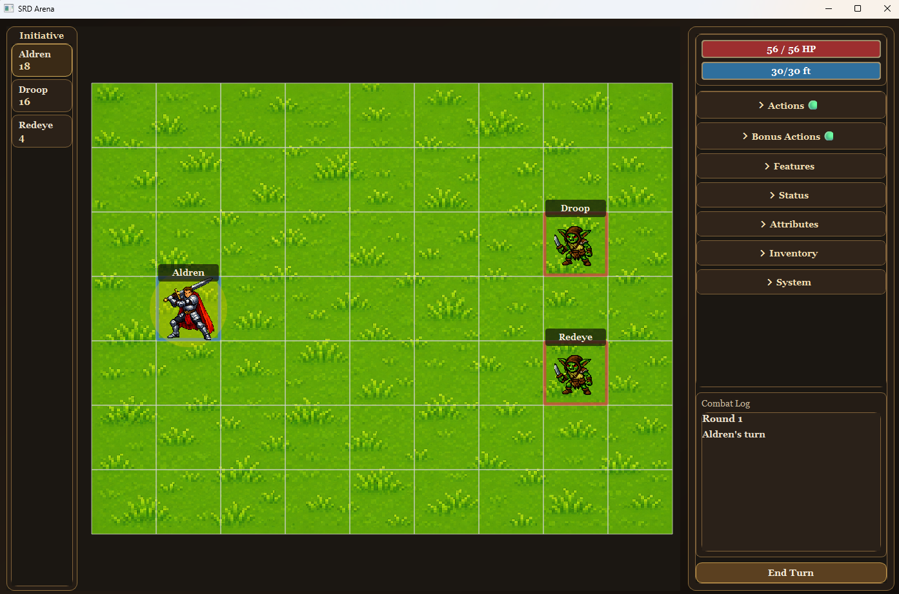
Der Nutzer klickt auf dem Spielfeld Aldren an und geht somit in den Bewegungsmodus. In der Vorschau kann mit der Maus ein Zielfeld ausgewählt werden. Dafür wird auch der Weg gezeichnet, den der Teilnehmer für das Zielfeld nimmt. Soll ein anderer Weg genommen werden, ist dies in mehreren Teilschritten möglich.
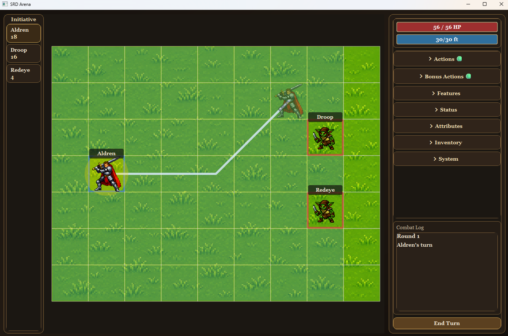
Der Nutzer bestätigt die Bewegung von Aldren und steht jetzt neben Droop. Oben rechts in der blauen Leiste ist zu sehen, dass Aldren damit 25 Fuß von seinen insgesamt 30 Fuß Bewegungsressourcen ausgegeben hat.
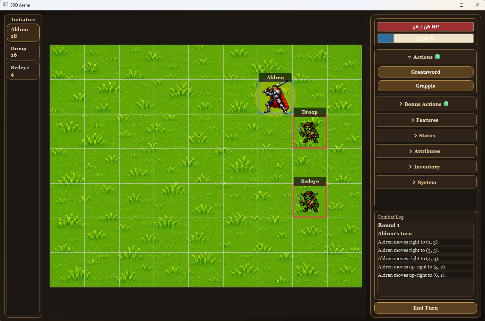
In der Seitenleiste wird die Greatsword-Attacke gewählt. Als valides Ziel erscheint um Droop ein blauer Kreis. Als nächstes klickt der Nutzer Droop an.
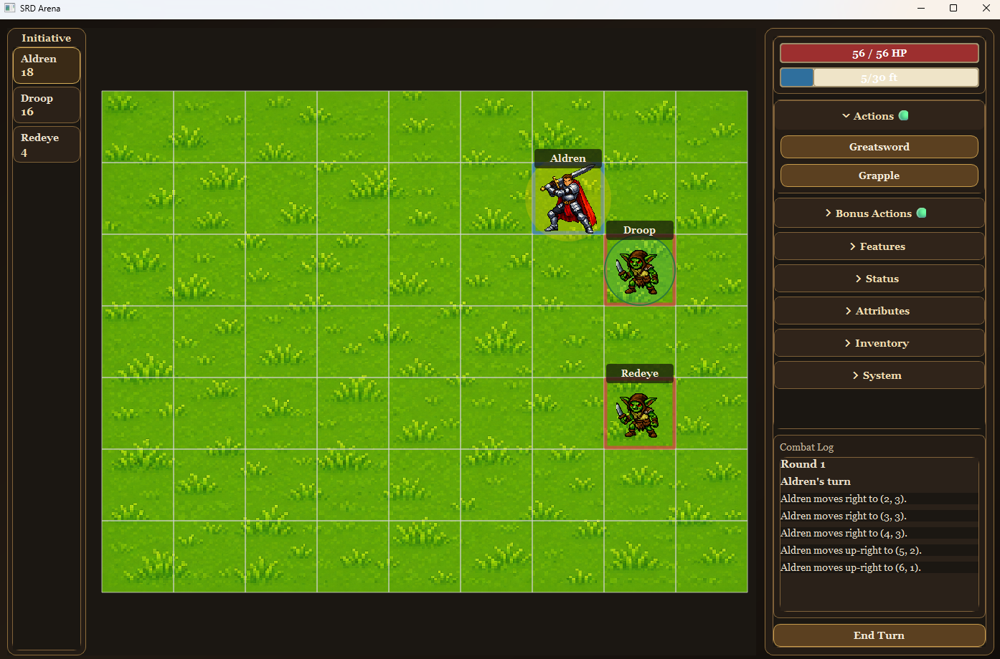
Aldren greift Droop an. Unten rechts ist im Combat Log der Trefferwurf (20-seitiger Würfel) zu sehen, sowie der Schadenswurf (2d6). Den Regeln entsprechend werden dem Würfelwurf noch Modifikatoren hinzugefügt.
Aldren macht 10 Punkte schaden, aber Droop hatte nur 10 Lebenspunkte. Er verschwindet aus der Initiative und vom Spielfeld.
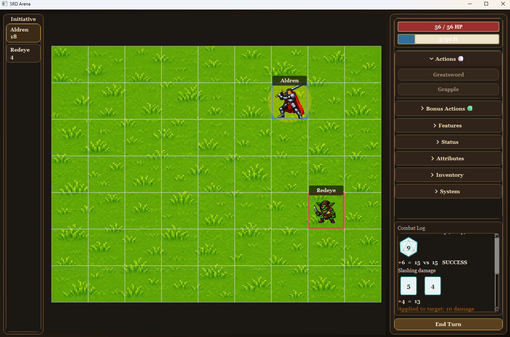
Aldren hatte noch 5 Fuß von seinem Movement, also geht er noch einen Schritt.
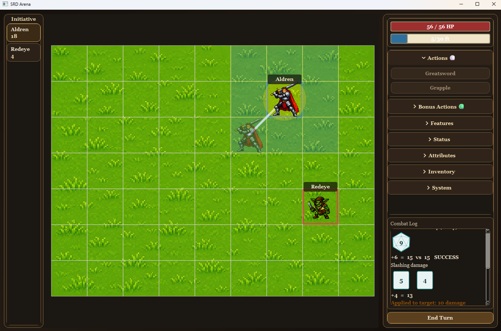
Redeye ist dran. Der Bot geht automatisch auf Aldren zu und greift ihn mit seinem Kurzschwert an, verfehlt ihn aber, wie unten Rechts im Combat log zu sehen ist.
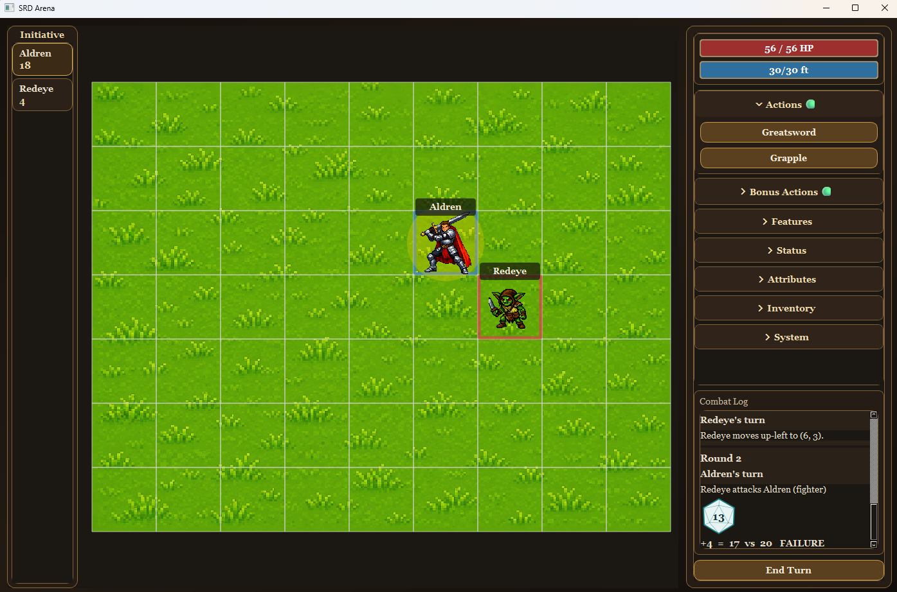
Aldren greift Redeye an, trifft, und der Kampf endet.
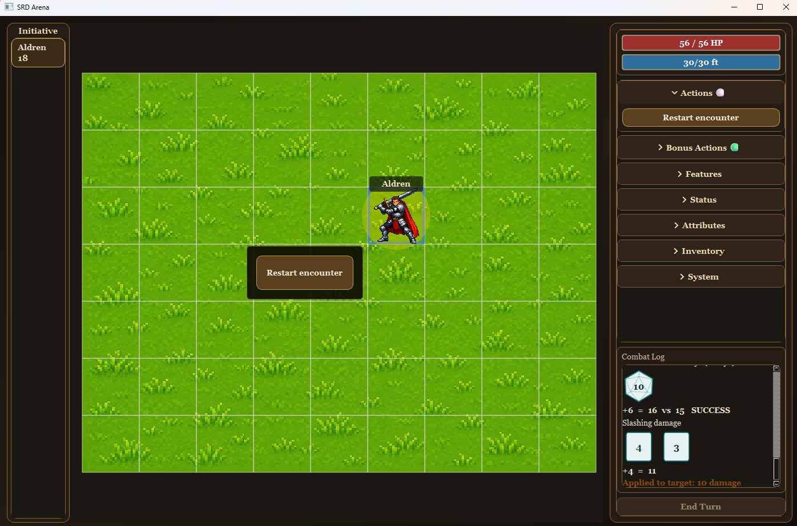

#### 7.2.2 Flächenzauber
In diesem Kampf übt ein Zauberer, der "Spectrum Adept", seine Flächenzauber gegen eine Gruppe von magischen Skeletten, die sich nicht bewegen.

Zuerst beschwört er einen Fireball. Ein Zauber, der 8d6 Schaden in einem Radius von 20 Fuß macht.
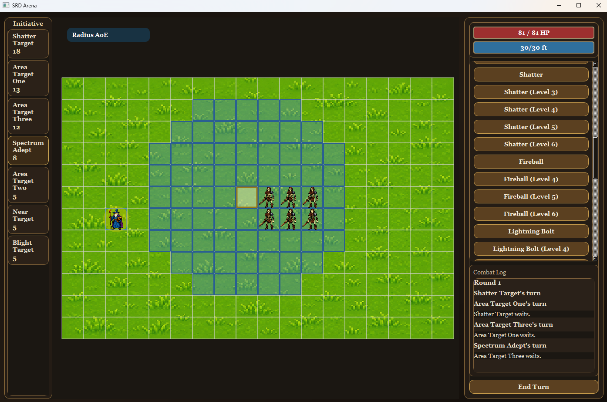
Drei Skelette fallen sofort, drei bleiben stehen, weil sie den Rettungswurf schaffen und nur den halben Schaden nehmen.
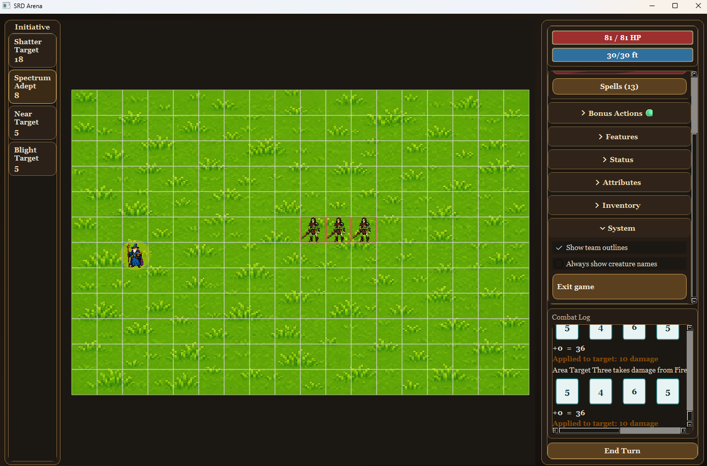
Als nächstes bringt sich der Zauber für einen Cone of Cold in Position.
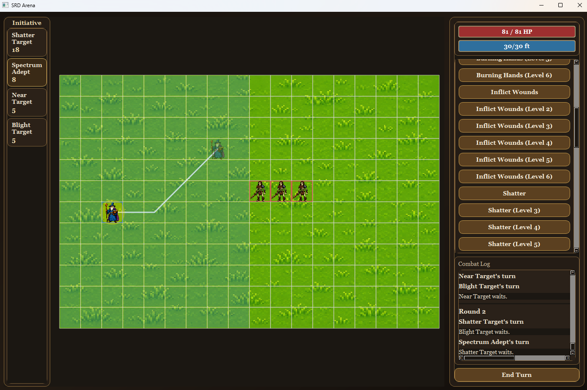
In der Vorschau kann er mit einem passend großen Kegel zielen.
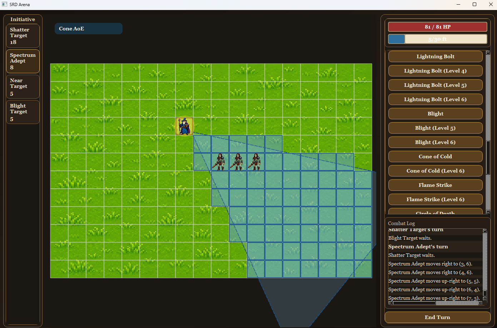
Nachdem er den Zauber wirkt, steht noch eines der Skelette, das wieder den Schaden durch einen Rettungswurf reduzieren konnte. Das reicht dem Zauberer an Übung.
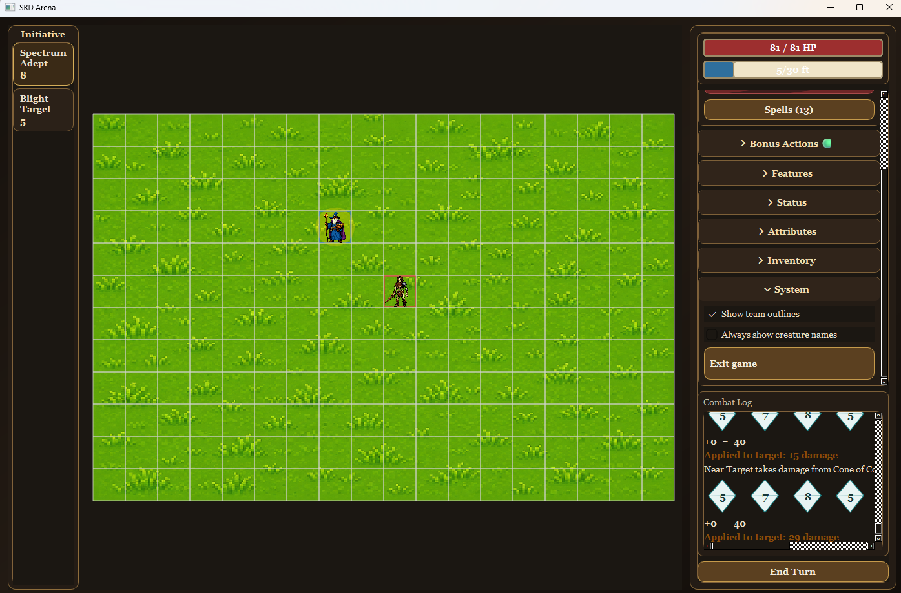


#### 7.2.3 Zwei Bots: Goblin-Duell
Hier kämpfen zwei Goblins ohne Nutzerinput gegeneinander. Der Kampf wird mehrmals neu gestartet. Um den automatischen Verlauf zu demonstrieren, habe ich ein kurzes Video aufgenommen: https://youtu.be/7Be6QPyMBgw

#### 7.2.4 Ungültiger Input
Dies ist ein Beispiel einer ungültigen Kampf-Definition. Ein ordentlicher Editor für Kampfszenarien würde nur JSON-Dateien produzieren, die gültig sind, aber für manuell erstellte Dateien können immer Fehler auftreten. Pydantic fängt diese Fehler ab und die GUI zeigt einen Fehler, wenn versucht wird, ein ungültiges Szenario zu laden. Das Szenario war ungültig, weil ein Goblin eine Startposition hatte, die nicht auf dem Spielfeld liegt.

Der Fehler könnte etwas schöner sein, reicht aber für das MVP.

### 7.3 Ausgewählte Code-Snippets

Die folgenden Ausschnitte vergleichen die Capabilities von `Burning Hands` und `Cone of Cold`. Beide Zauber verwenden einen vom Zaubernden ausgehenden Kegel, verlangen einen Rettungswurf und verursachen bei einem erfolgreichen Wurf halben Schaden. Unterschiede wie Kegellänge, Rettungswurfsattribut, Schadenswürfel, Schadensart und Skalierung werden durch die Inhaltsdaten beschrieben. Dadurch verwenden beide Definitionen denselben Builder und dieselbe Auflösungslogik.


```
Cone of Cold:
"You unleash a blast of cold air. Each creature in a 60-foot Cone originating from you makes a Constitution saving throw, taking 8d8 Cold damage on a failed save or half as much damage on a successful one. [...]"
...
  "capability": {
    "target": {
      "type": "area",
      "origin": "self",
      "geometry": {
        "shape": "cone",
        "length_feet": 60
      }
    },
    "resolution": {
      "type": "saving_throw",
      "ability": "con",
      "failure": {
        "effects": [
          {
            "type": "damage",
            "dice": "8d8",
            "damage_type": "cold"
          }
        ]
      },
      "success_damage": "half"
    },
    "scaling": [
      {
        "type": "slot_level",
        "above_level": 5,
        "per_level": [
          {
            "type": "damage_dice",
            "amount": "1d8"
          }
        ]
      }
    ]
  }
```
```

Burning Hands:
"A thin sheet of flames shoots forth from you. Each creature in a 15-foot Cone makes a Dexterity saving throw, taking 3d6 Fire damage on a failed save or half as much damage on a successful one."

  "capability": {
    "target": {
      "type": "area",
      "origin": "self",
      "geometry": {
        "shape": "cone",
        "length_feet": 15
      }
    },
    "resolution": {
      "type": "saving_throw",
      "ability": "dex",
      "failure": {
        "effects": [
          {
            "type": "damage",
            "dice": "3d6",
            "damage_type": "fire"
          }
        ]
      },
      "success_damage": "half"
    },
    "scaling": [
      {
        "type": "slot_level",
        "above_level": 1,
        "per_level": [
          {
            "type": "damage_dice",
            "amount": "1d6"
          }
        ]
      }
    ]
  }
```
